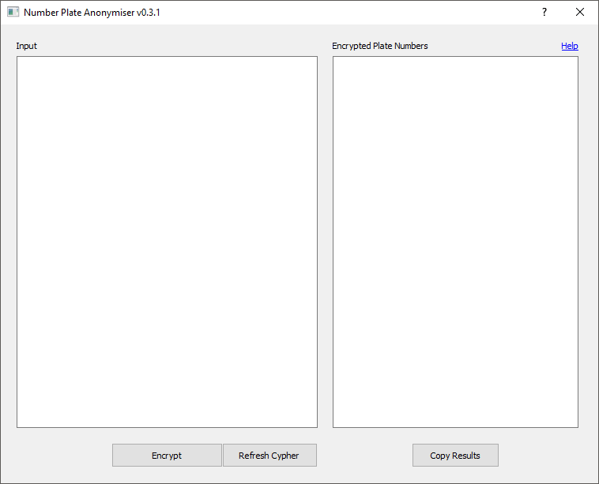

# :oncoming_automobile: :video_camera: Number-Plate-Anonymiser 
A Python interface for encrypting vehicle license plate data. Under GDPR, 
Transport Scotland can not interact with the raw number plate data if it could 
be used to identify people in conjunction with other datasets.

## Advice for Users
### Getting the latest release
Download the [latest release](https://github.com/TransportScotland/Number-Plate-Anonymiser/releases) 
of the project - this will be a `.exe` file, so care will need to be taken with
any firewall restrictions

### Using the anonymiser
After double-clicking the executable, a window that looks similar to (though 
maybe not exactly like) the following:



There are two main sections to this. Number plates to be anonymised should be 
entered or pasted into the left hand side, one per line. Once the "Encrypt"
button is pressed, the encrpyted plates will appear in the right-hand side.

The encryption process works in the following way for each provided plate:

1. First, any spaces are removed from the plate
2. For the first seven characters of the plate after spaces have been removes:
    - If the character is one of A-Z or 1-9, it is swapped according to the 
      cypher for that position (e.g. the first character and third character 
      have different relationships defined)
    - If the character is *not* one of A-Z or 1-9 it is ignored but is still
      counted as one of the seven characters to be processed.

For example, if a provided number plate was `FG6###8PV`, an example conversion
for this could be `XYQ0`.

## Advice for Developers
### Environment
Proper use of the `requirements.txt` file should allow for a replication of the
environment used to produce the executables contained in the Releases section,
through `pip install -r requirements.txt`. Should any additional modules be 
required by future versions of the anonoymiser, these **must be detailed** 
in `requirements.txt`.

### Generating the executable
The bundled executable file for this interface is generated using PyInstaller 
with the `.spec` file in this repository.

Using the `gui.ui` file with `PyInstaller` and `--onefile` seems to be a massive 
pain. To get around this, we can instead use `PyQt5`'s own inbuilt converter to 
convert from a `.ui` file to a regular `.py` file. The short version to do this 
is:
```shell script
python -m PyQt5.uic.pyuic -x gui.ui -o gui.py
```
**Please note** whenever this command is run, the previous version of `gui.py` 
is completely overwritten. As such, it's recommended that `gui.py` is not 
edited, with changes instead made in the `.ui` file or `main.py` accordingly.

### Detailing versions
The version of the anonymiser should be detailed in two locations - firstly in 
the [`_version.py`](/Number-Plate-Anonymiser/_version.py) file and secondly 
through Git tags (to allow for easy, semi-automated marking of releases on 
Github). The final commit before generating a new executable should be to update
the value in `_version.py`.
